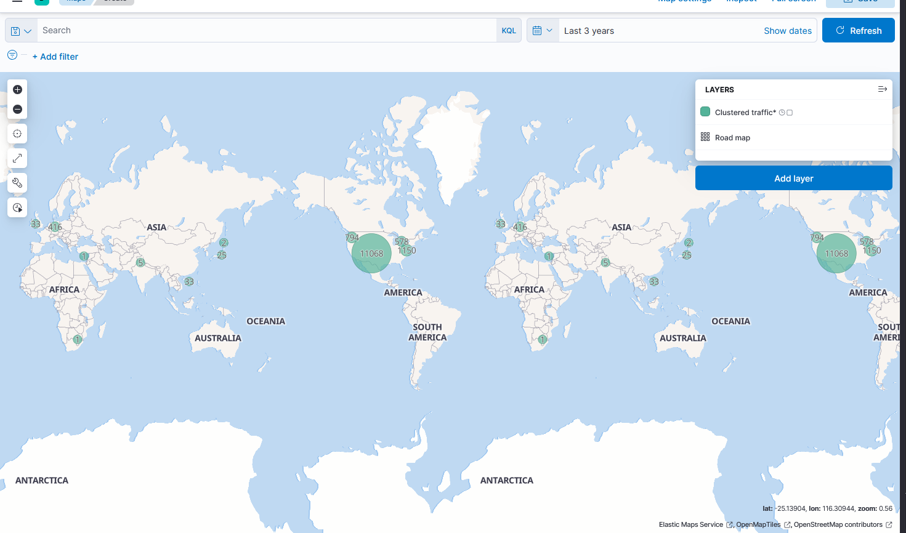
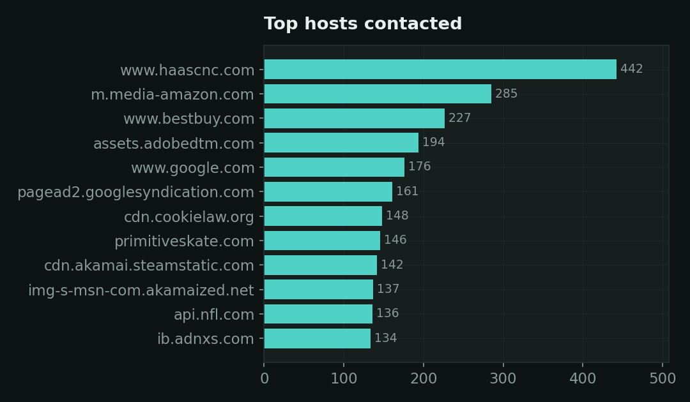
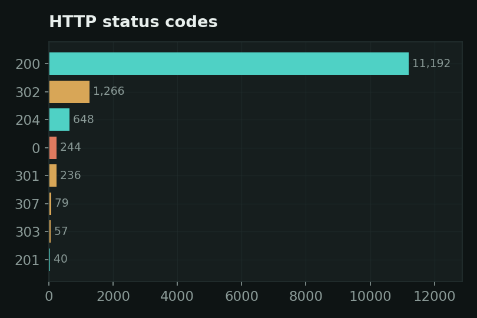
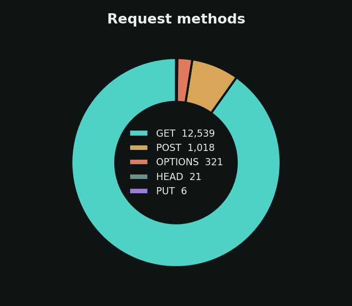
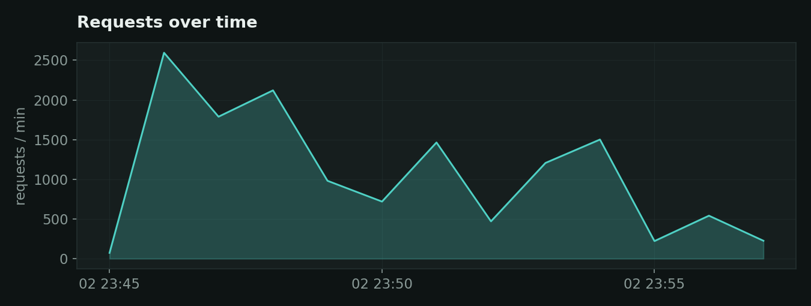

# HAR Traffic Analyzer

Turn a browser's network capture into a searchable, visual map of **every
server your machine talked to** — geolocated, over time, with status codes,
methods, and response sizes. A small, self-contained traffic-analysis lab
built on the ELK stack (Elasticsearch + Logstash + Kibana), handy for spotting
trackers, ad networks, third-party calls, and odd beaconing.

## What it looks like

The payoff is a live map of **every server your traffic reached**, geolocated
from each response's IP address — built in Kibana from the data this pipeline
loads:



The charts below are generated from the included sample — **13,907 real HTTP
requests** captured during a short browsing session. In Kibana you get all of
this live and interactive alongside the map above.

**Where the traffic went** — the domains contacted most:



**How requests resolved** and **what kinds they were:**




**Volume over the capture window:**



> The map above is a real screenshot. To refresh it or add more, see
> [Updating the screenshots](#updating-the-screenshots).

## How it works

```
.har capture ──▶ scripts/har_to_csv.py ──▶ data/traffic.csv ──▶ Logstash ──▶ Elasticsearch ──▶ Kibana
```

1. **Capture** traffic as a HAR file (browser DevTools → Network → right-click →
   *Save all as HAR*), and drop it in `captures/`.
2. **Convert** the HAR(s) into one tidy CSV.
3. **Logstash** reads the CSV, parses timestamps and numbers, and geolocates
   each server IP.
4. **Elasticsearch** stores it; **Kibana** searches and visualizes it.

## Quick start

You only need Docker. The repo ships a sample dataset, so it works immediately
with no capture of your own.

```bash
# 1. Start Elasticsearch, Logstash, and Kibana
docker compose up -d

# 2. Create the Kibana data view (waits for Kibana to be ready)
./scripts/setup_kibana.sh

# 3. Open Kibana
#    http://localhost:5601  →  Discover
```

The sample data is from **Oct 2, 2023**, so in Kibana set the time range to
include that date (e.g. *Last 5 years*) to see the events.

First boot pulls the Elastic images and can take a few minutes. Check progress
with `docker compose logs -f`.

## Use your own traffic

```bash
# Put one or more .har files in captures/, then:
python scripts/har_to_csv.py captures -o data/traffic.csv

# Reload it into Elasticsearch:
docker compose restart logstash
```

`har_to_csv.py` flattens every request into these columns: `timestamp, method,
url, host, scheme, path, extension, status, status_text, response_bytes,
time_ms, mime_type, server_ip, referer, user_agent`.

## Build the dashboard in Kibana

The data view and the geo_point mapping are set up automatically (the Logstash
template handles geo; the data view is created on startup, or make it by hand
under **Stack Management → Data Views** with pattern `traffic*` and time field
`@timestamp`). Set the time picker to **Last 5 years** — the sample is from
Oct 2023.

Then build these against the `traffic*` data view:

- **The map (centerpiece)** — *Maps* → Create map → Add layer → **Documents** →
  `traffic*` → geospatial field **`geo.location`**. Color the points by
  `geo.country_name` or `status` in the layer style.
- **Top hosts** — *Lens* bar chart, top values of `host`.
- **Status codes** — *Lens* pie, top values of `status`.
- **Requests over time** — *Lens* line, `@timestamp` on the horizontal axis.
- **Largest responses** — *Lens* data table sorted by `response_bytes`.

Add the saved visualizations to a **Dashboard** to get the interactive overview.

## Updating the screenshots

The map image in this README was captured from a running instance. To refresh
it (or add more, e.g. a Discover view or the full dashboard):

1. Open the view in Kibana and click **Full screen** for a clean frame.
2. Capture with your OS tool (Windows: `Win + Shift + S`) and save into `docs/`,
   e.g. `docs/kibana_map.png`.
3. Reference it here and commit. Note: if your repo's `.gitignore` ignores
   `*.png`, add `!docs/*.png` so these are tracked.

## Project layout

```
docker-compose.yml         The ELK stack (Elasticsearch + Logstash + Kibana)
docker-compose.https.yml   Optional overlay: HTTPS on Kibana
start.ps1                  One command: bring the stack up (HTTP) + configure
start-https.ps1           One command: same, with HTTPS on Kibana
logstash/
  logstash.conf            Parses the CSV, parses dates/numbers, adds geoip
  traffic-template.json    Forces geo.location to geo_point (so Maps works)
kibana/
  kibana.yml               Kibana TLS config (used by the HTTPS overlay)
scripts/
  har_to_csv.py            HAR captures -> one tidy CSV
  setup_kibana.sh          Creates the Kibana data view via the API
data/
  sample_traffic.csv       Committed sample so the stack runs out of the box
  traffic.csv              Your full dataset (git-ignored)
captures/                  Drop your .har files here (git-ignored)
certs/                     Generated TLS certs (git-ignored)
docs/                      README images
```

## Notes

- Pinned to ELK **7.17.18** so it runs without the passwords/TLS that 8.x
  requires by default — simplest path for a local lab. Not meant to be exposed
  to a network as-is.
- HAR captures can contain cookies, tokens, and URLs from your real browsing.
  `captures/*.har` and `data/*.csv` (except the sample) are git-ignored so you
  don't push sensitive data by accident.
