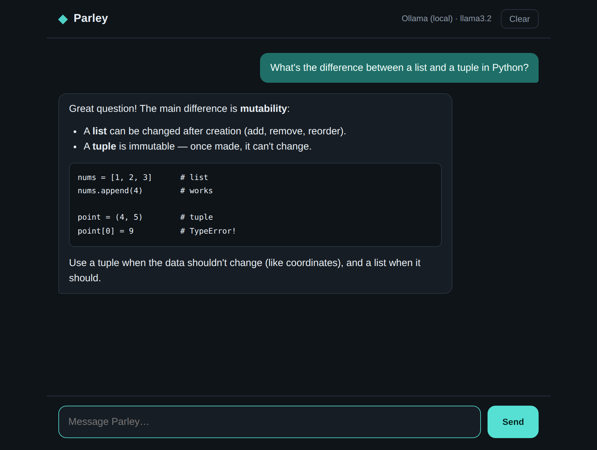

# Parley

A tiny, self-hosted AI chat app that runs on **any free LLM provider** — cloud
or fully local. No paid APIs, no lock-in: pick a provider, point a `.env` at it,
and chat.



## Why

It started as a half-working demo wired to two paid services (Twilio for SMS and
a since-removed OpenAI model). Parley keeps the good part — a clean chat web app
with conversation memory and markdown rendering — and swaps in free,
interchangeable providers behind a single interface.

## Pick a free provider

All four speak the same OpenAI-compatible format, so switching is just three
lines in `.env`. Defaults to Groq.

| Provider | Cost | Notes |
| --- | --- | --- |
| **Groq** (default) | Free, no card | Fastest free inference; runs Llama and others |
| **Google Gemini** | Free, no card | Most capable free tier (~1,500 requests/day, 1M context) |
| **OpenRouter** | Free models | Widest model selection through one key |
| **Ollama** | Free forever | Fully local — no signup, no key, fully private |

## Quick start

```bash
# 1. Install dependencies
pip install -r requirements.txt

# 2. Configure a provider
cp .env.example .env
#    Then open .env and fill in one provider. For the default (Groq),
#    grab a free key at https://console.groq.com/keys

# 3. Run it
python app.py
```

Open **http://localhost:5000** and start chatting.

### Fully local, no signup (Ollama)

Want zero accounts, no key, and full privacy? Install
[Ollama](https://ollama.com), then:

```bash
ollama run llama3.2          # downloads the model, then runs it
```

Switch `.env` to the Ollama preset (already in `.env.example`) and restart.
Everything runs on your machine — the screenshot above is Parley on Ollama.

> Tip: to keep large model files off your system drive, set the `OLLAMA_MODELS`
> environment variable to a folder on another disk before pulling a model.

## How it works

```
Browser (chat UI) ──▶ Flask /api/chat ──▶ llm.py ──▶ your chosen provider
```

- `app.py` — Flask server: serves the UI and a small JSON chat API.
- `llm.py` — one OpenAI-compatible client that talks to whichever provider
  `.env` points at, with friendly handling for a missing key.
- `templates/index.html`, `static/` — the chat interface: conversation memory,
  markdown rendering, auto-growing input. The markdown library is vendored
  locally, so the app needs no internet beyond the LLM API itself.

## Configuration

Everything lives in `.env` (see `.env.example`):

- `LLM_BASE_URL`, `LLM_API_KEY`, `LLM_MODEL` — which provider and model.
- `LLM_SYSTEM_PROMPT` — change the assistant's personality.
- `PORT` — web server port (default 5000).

## Notes

- `.env` is git-ignored, so your key never gets committed.
- This is a local/dev server. To expose it publicly, run it behind a real WSGI
  server (gunicorn/waitress) and a reverse proxy.
