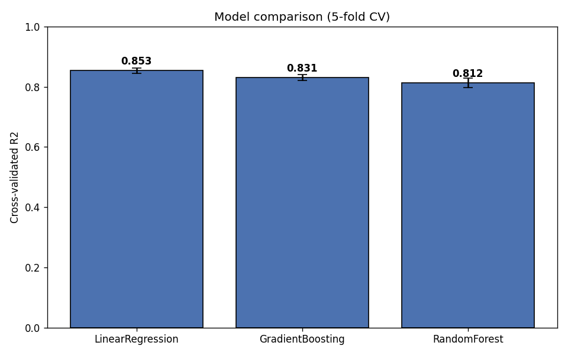
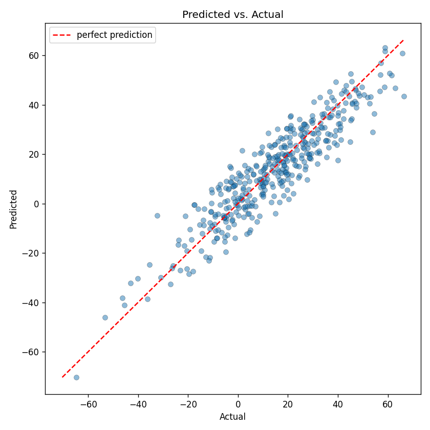
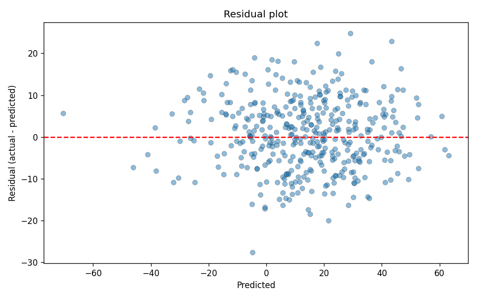
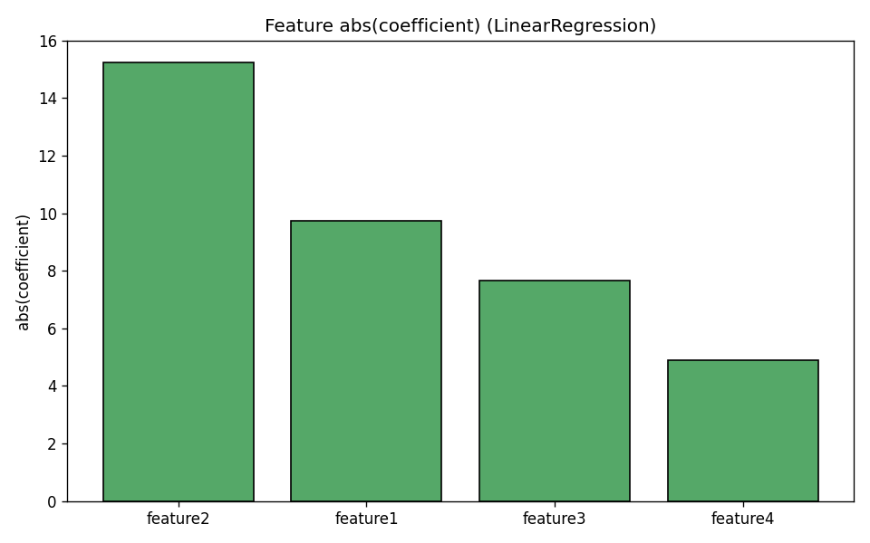

# Predictive Analytics Tool

A modular machine-learning project that generates data, cleans and normalizes
it, **compares multiple models with cross-validation**, trains the best one,
and produces diagnostic visualizations. Built as a clean GitHub portfolio piece.

## What it does

1. Generates a reproducible synthetic dataset (2,000 rows, linear signal + noise).
2. Cleans (drops NaNs) and z-score normalizes the features.
3. Cross-validates three models — LinearRegression, RandomForest, GradientBoosting.
4. Selects the best by 5-fold CV R², trains it, and evaluates on a holdout set.
5. Saves the trained model and four diagnostic plots.

## Results

Running `python main.py` produces:

```
Model comparison (5-fold CV R2):
           model  cv_r2_mean  cv_r2_std
LinearRegression       0.924      0.020
GradientBoosting       0.795      0.057
    RandomForest       0.772      0.069

Selected: LinearRegression
Holdout R2:  0.936
Holdout MAE: 4.542
```

LinearRegression wins because the synthetic target is a linear combination of
the features — a good reminder that the simplest model often beats ensembles
when it matches the underlying structure.

### Model comparison

Cross-validated R² for each candidate, with error bars. Tested rather than
assumed — the simplest model came out on top.



### Predicted vs. actual

Predictions form a tight, unbiased cloud along the ideal-fit line across the
full range of values.



### Residuals

A structureless cloud centered on zero — the leftover error is just the noise
baked into the data, confirming the model captured the real signal.



### Feature importance

Coefficient magnitudes recover the true driver ordering used to build the data.



## Project Structure

```
predictive-analytics-tool/
├── data/
│   ├── generate_data.py     # creates data/raw/sample_data.csv
│   ├── raw/  processed/     # gitignored
├── docs/                    # plots embedded in this README (committed)
├── models/                  # trained model.pkl (gitignored)
├── reports/                 # plots from each run (gitignored)
├── notebooks/
├── src/
│   ├── data_processing.py   # load / clean / normalize / split
│   ├── model.py             # compare_models / train_model / load_model
│   └── visualization.py     # prediction, residual, comparison, importance plots
├── tests/                   # pytest suite (8 tests)
├── main.py                  # end-to-end pipeline
├── README.md  requirements.txt  setup.py
```

## Quick start

```powershell
# Windows / PowerShell
python -m venv .venv
.\.venv\Scripts\Activate.ps1
pip install -r requirements.txt
python main.py            # runs the full pipeline, writes reports/
python -m pytest          # 8 tests
```

```bash
# macOS / Linux
python3 -m venv .venv
source .venv/bin/activate
pip install -r requirements.txt
python main.py
python -m pytest
```

> The plots in this README live in `docs/` so they render on GitHub. The pipeline
> writes fresh copies to `reports/` (gitignored) on every run; to refresh the
> README images, copy `reports/*.png` into `docs/`.

## Using the modules directly

```python
from src.data_processing import load_data, clean_data, process_data, split_features_target
from src.model import compare_models, train_model

df = process_data(clean_data(load_data("data/raw/sample_data.csv")))
X, y = split_features_target(df)
print(compare_models(X, y))          # cross-validated leaderboard
model, metrics, results = train_model(X, y)
print(metrics)
```
