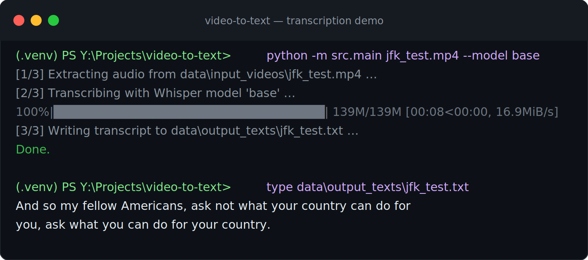

# Video-to-Text Transcriber

Extract the audio track from a video file and transcribe it to text using
[OpenAI Whisper](https://github.com/openai/whisper). Ships with a command-line
interface, error handling, and a mocked test suite that runs in CI without
downloading any models.

## Demo



A single command extracts the audio, runs Whisper, and writes a clean transcript.

## Features

- Transcribe any video format MoviePy/ffmpeg can read (`.mp4`, `.mov`, `.mkv`, ...).
- Selectable Whisper model size (`tiny` → `large`/`turbo`) to trade speed for accuracy.
- Clean CLI with sensible defaults and helpful error messages.
- Fast, dependency-light test suite (Whisper and MoviePy are mocked).

## Requirements

- Python 3.10+
- [ffmpeg](https://ffmpeg.org/) on your system PATH (required by Whisper)
  - macOS: `brew install ffmpeg`
  - Ubuntu: `sudo apt install ffmpeg`
  - Windows: `winget install Gyan.FFmpeg --source winget`

## Setup

```bash
# macOS / Linux
bash scripts/setup_env.sh
source .venv/bin/activate
```

```powershell
# Windows / PowerShell
.\scripts\setup_env.ps1
```

Or manually:

```bash
python -m venv .venv && source .venv/bin/activate
pip install -r requirements-dev.txt
```

## Usage

```bash
# Simplest: transcribe a video, transcript saved to data/output_texts/<name>.txt
python -m src.main path/to/video.mp4

# Choose a larger model and a custom output path
python -m src.main interview.mov --model small --output transcript.txt

# Keep the intermediate .wav file
python -m src.main clip.mp4 --keep-audio
```

A bare filename resolves against `data/input_videos/`, so you can also do:

```bash
python -m src.main example_video.mp4
```

### CLI options

| Flag | Description |
|------|-------------|
| `video` | Path to the input video (or a filename in `data/input_videos/`). |
| `-o, --output` | Output `.txt` path. Defaults to `data/output_texts/<video>.txt`. |
| `-m, --model` | Whisper model: `tiny`, `base`, `small`, `medium`, `large`, `turbo`. Default `base`. |
| `--keep-audio` | Keep the extracted `.wav` instead of deleting it. |

### Model size matters

Larger models are more accurate but slower and need more memory. The difference
is easy to see on the same 11-second clip:

| Model | Output |
|-------|--------|
| `tiny` | "...ask what you can do for your country. **And so my fellow Americans ask not what your country can do for your country.**" (repeats/hallucinates the tail) |
| `base` | "And so my fellow Americans, ask not what your country can do for you, ask what you can do for your country." (clean) |

`base` is a good default. Use `tiny` for quick drafts and `small`/`medium` for
higher quality on harder audio.

## Project structure

```
video-to-text/
├── .github/workflows/ci.yml   # runs tests on every push
├── data/
│   ├── input_videos/          # put source videos here
│   └── output_texts/          # transcripts land here
├── docs/                      # README assets
├── scripts/
│   ├── setup_env.sh           # macOS / Linux setup
│   └── setup_env.ps1          # Windows setup
├── src/
│   ├── audio_extractor.py     # video -> 16 kHz wav (MoviePy)
│   ├── transcriber.py         # wav -> text (Whisper)
│   └── main.py                # CLI orchestration
├── tests/                     # mocked unit tests (no model download)
├── requirements.txt
└── requirements-dev.txt
```

## Testing

```bash
python -m pytest
```

The tests mock MoviePy and Whisper, so they run in well under a second and
require neither ffmpeg nor a model download. This is what the CI workflow runs.

## How it works

1. **Audio extraction** (`audio_extractor.py`) — MoviePy opens the video and
   writes a 16 kHz WAV (Whisper's expected sample rate).
2. **Transcription** (`transcriber.py`) — Whisper loads the chosen model
   (cached between calls) and transcribes the audio.
3. **Orchestration** (`main.py`) — ties the two together, manages the temp file,
   and writes the final transcript.

## Notes

- The first run with a given model downloads it once (cached afterward).
- On CPU, Whisper prints `FP16 is not supported on CPU; using FP32 instead` —
  this is expected and harmless. A CUDA-enabled PyTorch build will use the GPU
  automatically and run substantially faster.
